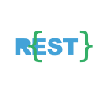

## Hi there 👋

<!--
**galaxy-sea/galaxy-sea** is a ✨ _special_ ✨ repository because its `README.md` (this file) appears on your GitHub profile.

Here are some ideas to get you started:

- 🔭 I’m currently working on ...
- 🌱 I’m currently learning ...
- 👯 I’m looking to collaborate on ...
- 🤔 I’m looking for help with ...
- 💬 Ask me about ...
- 📫 How to reach me: ...
- 😄 Pronouns: ...
- ⚡ Fun fact: ...
-->

<table cellpadding="0" cellspacing="0">
  <tbody>
    <tr>
      <td>
        
      </td>
      <td rowspan=2>
        
      </td>
    </tr>
    <tr>
      <td>
        
      </td>
    </tr>
  </tbody>
</table>

**Tools, languages, and other things that I like to work with.**

